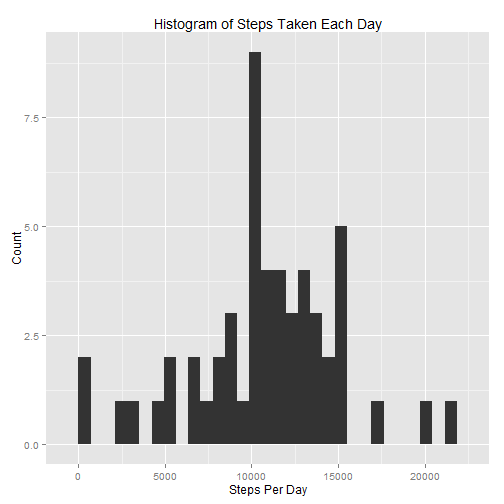
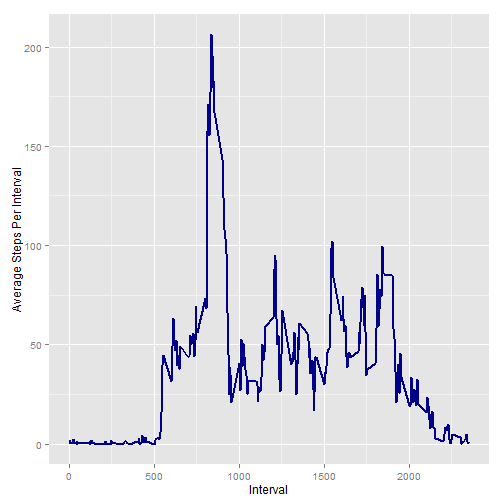
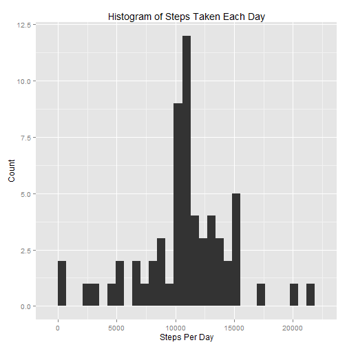
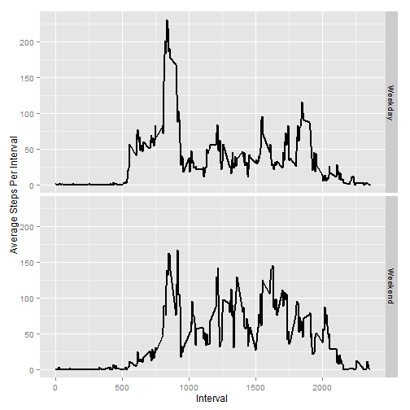

###Introduction

Nowadays people are using devices to monitor personal movement, for example, Nike Fuelband or Fitbit. The devices measure movement in an individual to improve their health by finding patterns in their behavior. This report will analyze 17,568 observations of data from an anonymous individual collected during two months.


###Loading Data and Required Libraries


```r
setwd("C:/ReproducibleResearch")
library(ggplot2)
library(plyr)
inp <- read.csv("activity.csv",header=T)
na <- is.na(inp$steps)
clean <- inp[!na,]
```

The format file and variables is the following:


```r
head(clean)
```

```
##     steps       date interval
## 289     0 2012-10-02        0
## 290     0 2012-10-02        5
## 291     0 2012-10-02       10
## 292     0 2012-10-02       15
## 293     0 2012-10-02       20
## 294     0 2012-10-02       25
```

###What is mean total number of steps taken per day?

The distribution of the variable Steps is shown in the following plot:


```r
cleansum <- ddply(clean,c("date"),summarise,Steps=sum(steps))
mn <- format(mean(cleansum$Steps),digits=7)
med <- median(cleansum$Steps)
qplot(cleansum$Steps,bindwith=100,xlab="Steps Per Day",ylab="Count",main="Histogram of Steps Taken Each Day")
```

```
## stat_bin: binwidth defaulted to range/30. Use 'binwidth = x' to adjust this.
```

 

The mean of the variable Steps is 10766.19 and the median is 10765

###What is the average daily activity pattern?

With the following code, one can calculate the average of the steps taken at each interval and plot a time series:


```r
agg <- ddply(clean,c("interval"),summarise,Mean=mean(steps))
max <- subset(agg,Mean==max(Mean))
maxI <- max$interval
maxS <- round(max$Mean,2)
ggplot(agg,aes(interval,Mean)) + geom_line(colour="darkblue",size=1)+xlab("Interval")+ylab("Average Steps Per Interval")
```

 

From the plot and the code one can identify that the maximum average of steps taken per interval takes place at 835 and corresponds to a maximum of 206.17  

###Imputing missing values

In the previous plots and  calculations the NA values in the dataset were excluded. However, one can also use a strategy to impute missing values. In this report, the mean for each interval will be used. The following code implements this strategy:


```r
narows <- inp[na,]
mer <- merge(narows,agg,by.x="interval",by.y="interval")
mer$steps <- mer$Mean
mer <- mer[,1:3]
imputed <- rbind(clean,mer)
head(imputed)
```

```
##     steps       date interval
## 289     0 2012-10-02        0
## 290     0 2012-10-02        5
## 291     0 2012-10-02       10
## 292     0 2012-10-02       15
## 293     0 2012-10-02       20
## 294     0 2012-10-02       25
```

With the following code, a histogram will be plotted to demonstrate the effect of the NA imputation methodology:


```r
imputedsum <- ddply(imputed,c("date"),summarise,Steps=sum(steps))
mnfull <- format(mean(imputedsum$Steps),digits=7)
medfull <- format(median(imputedsum$Steps),digits=7)
qplot(imputedsum$Steps,bindwith=100,xlab="Steps Per Day",ylab="Count",main="Histogram of Steps Taken Each Day")
```

```
## stat_bin: binwidth defaulted to range/30. Use 'binwidth = x' to adjust this.
```

 

The mean of the variable Steps is 10766.19 and the median is 10766.19. The imputations didn't change the mean of the distribution, however the distribution median now equals the mean.

###Are there differences in activity patterns between weekdays and weekends?


```r
imputed$weekday <- (weekdays(as.Date(imputed$date)))
imputed$weekend <- factor(ifelse (imputed$weekday %in% c("Saturday","Sunday"),"Weekend","Weekday"))
imputedagg <- ddply(imputed,c("interval","weekend"),summarise,Mean=mean(steps))
ggplot(imputedagg,aes(interval,Mean)) + geom_line(size=1)+xlab("Interval")+ylab("Average Steps Per Interval") + facet_grid(weekend~.)
```

 

